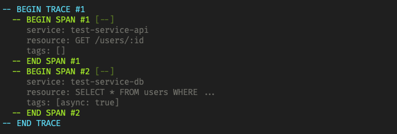

# SpandexConsole

This library provides a [Spandex](https://hexdocs.pm/spandex/readme.html) tracer adapter
that displays all generated traces and spans in the console. This library is intended for
local development usage **ONLY**, and **SHOULD NOT** be used in a production environment.



## Installation

```elixir
def deps do
  [{:spandex_console, "~> 0.1.0", only: [:dev, :test], runtime: false}]
end
```

## Setup and Configuration

Assuming you've defined your tracer like so:

```elixir
defmodule MyApp.Tracer do
  use Spandex.Tracer, otp_app: :my_app
end
```

Configure the adapter:

```elixir
# config/dev.exs

config :my_app, MyApp.Tracer,
  adapter: SpandexConsole.Adapter
```

Add `SpandexConsole.Adapter` to your application's supervision tree:

```elixir
defmodule MyApp.Application do
  # ...

  @impl Application
  def start(_, _) do
    children = [
      # ...
      SpandexConsole.Adapter # add this line
    ]

    opts = [strategy: :one_for_one, name: MyApp.Supervisor]
    Supervisor.start_link(children, opts)
  end
end
```

If you want to use this library during tests, you'll need to enable trace recording. You'll also
probably want to silence output to prevent noise in your test runner:

```elixir
# config/test.exs

config :spandex_console,
  silent: true, # disable console output
  record: true  # record traces and spans
```

## Usage in Tests

In addition to displaying traces during local development, this library can be used to record and assert
against generated traces and spans during testing. In the setup for your test, make sure to start both the
adapter and the sender.

```elixir
defmodule MyApp.HelloWorldTest do
  use ExUnit.Case, async: false # disable async to prevent traces/spans
                                # mixing between test cases

  setup do
    start_supervised!(SpandexConsole.Adapter)
    start_supervised!(SpandexConsole.Sender)

    :ok
  end

  test "hello_world/0" do
    # do something that generates a trace...
    MyApp.Tracer.start_trace("test-span", [])
    MyApp.Tracer.finish_trace()

    # assert on all recorded traces
    assert [%{id: 1, spans: [%{name: "test-span"}]}] = SpandexConsole.traces()

    # assert on all recorded spans
    assert [%{name: "test-span"}] = SpandexConsole.spans()

    # manually reset recording
    SpandexConsole.reset()
  end
end
```

Note that a trace won't appear until `finish_trace/0` has been called.

## Contributing

Before committing, make sure formatting and code style are correct by running the following commands:

```
mix format
mix credo
```
